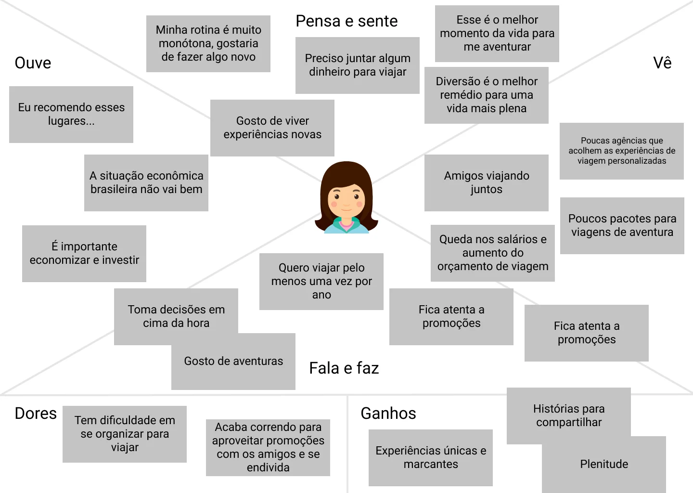

# O que é Design Thinking

 

## Introdução

Para começar os estudos sobre este assunto, usaremos o projeto realizado junto à empresa de viagens **Andarilho**.

Este cliente possui uma loja física e outra virtual para vendas de pacotes, e nos reportou um problema relacionado à **comunicação** com os usuários ao longo das viagens.

Lidaremos com esta questão abordando o **Design Thinking** dentro das etapas de resolução.

Começaremos o curso entendendo sobre o **perfil** e as **demandas** dos usuários da empresa Andarilho, para então detectarmos a origem do problema de comunicação e pensarmos em soluções.

Ao longo do processo, geraremos alguns documentos de apoio entregáveis junto com a equipe criada dentro do sistema de Design Thinking.

Passaremos também pelo **Mapa de Empatia**, **Jornada de Usuário**, ***personas***, **protótipos** e **esboços** que trabalharemos.

Desta forma, nos aprofundaremos no entendimento sobre a aplicação do Design Thinking para **inovação** e **geração de novas ideias**.

 

## Entendendo a ideia

A **Andarilho** analisou seus negócios e nos reportou um problema: alguns clientes apontaram a **falta de uma comunicação eficiente** com a empresa durante as viagens, e não conseguiram o suporte esperado em algumas situações.

Possuem dois principais **canais de contato** com os usuários: **loja física** e **loja *online***, sem contar as redes sociais.

Com isso em mente, a empresa teve algumas ideias para resolver a questão, mas não obtiveram sucesso. Portanto, nosso trabalho com a dinâmica do **Design Thinking** foi solicitado para elaborar uma solução que atenda à demanda.

O primeiro passo foi criar pequenos **times interdisciplinares** com funcionárias e funcionários de diversas áreas, para que trabalhassem juntos com **visões diferentes** sobre as mesmas questões abordadas, diminuindo a chance de uma solução muito enviesada e enriquecendo o processo.

É recomendado que estas equipes sejam formadas por uma quantidade média de pessoas, com cerca de 5 a 8 membros para iniciar a dinâmica.

Com os times formados, pedimos à empresa que nos fornecesse as informações disponíveis sobre os clientes, seja a partir de pesquisa de mercado, perfil de usuários e etc. para lançamento de produtos, por exemplo.

A Andarilho nos entregou um **Perfil Etnográfico**, ou seja, um estudo do **comportamento social**, onde encontramos padrões de diversos critérios como faixa etária, interesses ou atividades. Desta forma, teremos alguns insumos mais objetivos sobre quem são as usuárias e usuários da empresa.

Analisando todas as informações, veremos alguns dados interessantes: a maioria é formada por mulheres entre 18 e 24 anos que apreciam atividades ao ar livre, carros e estudo de novos idiomas, além de terem um perfil explorador e preferirem pacotes de viagens mais baratos. Como são pessoas mais jovens que estão ingressando no mercado de trabalho, possuem um orçamento mais fechado. 

Ao invés de abordarmos todos os aspectos problemáticos, nosso foco será nas questões de comunicação com a empresa que ocorrem **durante** as viagens, mesmo contando com vários meios de contato com os clientes.

Portanto, além de levarmos em consideração os dados do Perfil Etnográfico, é importante sabermos que estes principais problemas acontecem em um ponto específico dentro da trajetória entre a empresa e as usuárias ou usuários.

Tendo em mente este contexto geral, pudemos iniciar pesquisas mais aprofundadas. Começamos pelos mecanismos de busca da internet de forma bem simples para levantar dados relevantes. Jornais e revistas também são fontes interessantes para reunir material.

Uma dica importante é tomarmos notas de tudo que foi aprendido com a obtenção dessas informações, para que possamos revisitar e aprimorar nosso trabalho. Nossos times fizeram anotações em *post-its*, folhas avulsas, celulares e outros suportes, registrando frases e palavras-chave, por exemplo.

É bastante comum vermos o uso de post-its em dinâmicas de Design Thinking, pois são materiais fáceis de manipular e organizar, mas claro que não é obrigatório para realizar um bom trabalho, afinal o importante é entendermos o **processo em si**.

Retiramos alguns fragmentos da pesquisa inicial, como uma notícia que reuniu os seis problemas mais comuns em viagens e formas dos usuários evitá-los, por exemplo. Logo, partimos diretamente para uma questão que ocorre no mesmo ponto de nosso foco com a Andarilho.

Registramos uma página com o "Guia da Mulher Aventureira - dicas para viajar sozinha", já que nosso público marjoritário possui estes traços. Também obtivemos *links* sobre planejamento, pesquisa de preços, média de gasto e frequência de viagens por ano das usuárias e usuários do Brasil.

Outra ação comum de ser tomada é o ***benchmark***, termo bastante conhecido pelos profissionais de **Marketing** e **Publicidade**. Esta estratégia consiste em fazer uma pesquisa de concorrentes, buscando outras agências e aplicativos com esses recortes para analisarmos quais ações podem ser úteis para nos inspirar.

Estas são as pesquisas mais básicas para iniciarmos o processo de compreensão de todo o contexto e do problema que devemos solucionar para a Andarilho.

 

## Mapa de empatia

Já fizemos nossas pesquisas iniciais, mas precisamos aprofundá-las ainda mais.

Até o momento, temos o perfil de usuários e podemos entrar em contato diretamente com as pessoas para ouvi-las e esclarecer questões relativas ao nosso objetivo.

Para isso, pensamos em criar um **questionário** online para otimizar as entrevistas e a obtenção de avaliações, e assim entendermos melhor as demandas dos clientes.

A primeira pergunta diz respeito aos **problemas de infraestruturas** encontrados nos locais para onde os clientes costumam viajar. Esta questão é bastante abrangente por ser aberta, possibilitando respostas mais amplas e diversas que nos ajudam em nossos *insights*.

Em seguida, perguntamos o que é **essencial** levar em uma viagem. Assim, as pessoas podem listar os itens mais importantes que nos dão uma gama maior de elementos para analisarmos.

A terceira pergunta busca descobrir qual é a maior **preocupação** dos usuários quando viajam, para que então possamos saber quais as dores e expectativas negativas que devemos ter em mente.

Depois, perguntamos qual é o **contato** com a Andarilho durante as viagens. Percebemos que a resposta pode ser bem subjetiva, pois cada usuária ou usuário possui uma necessidade própria. Pensando nisso, colocamos alguns exemplos para orientar e filtrar melhor as informações recebidas, como "verifica sempre perfil e pedidos", "entra em contato com atendimento", "não acessa nada relacionado com a empresa" e etc.

Como quarta pergunta, questionamos se os clientes encontram **problemas** para realizar essas tarefas atualmente. Desta forma, podemos detectar falhas mais concretas.

Após esta pesquisa, selecionamos os dados mais relevantes para nosso trabalho e o registramos em um documento próprio.

Os principais problemas apresentados na primeira pergunta apontam que o WiFi não está disponível, sendo necessário o uso de dados móveis do celular, além de prejudicar o uso de computadores na região. Portanto, lidamos com uma limitação de internet e de uso de telas que deve ser resolvida.

Na segunda questão, as usuárias e usuários indicaram que o celular, a câmera fotográfica e de vídeo - principalmente a **GoPro** - são itens essenciais para este tipo de viagem.

Como terceira resposta, as maiores preocupações foram: ter alguma dificuldade financeira, afinal são pessoas com orçamento mais limitado, não ter comunicação suficiente para enfrentar problemas durante as viagens e perder o contato para obter orientações em locais inóspitos.

Em relação ao contato com a empresa durante as viagens, descobrimos que grande parte dos clientes costumam verificar se há algum desencontro de informações com os locais e passeios inclusos no pacote, entram em contato com o atendimento para eventuais dúvidas e acessam menos os meios de comunicação da empresa após a segunda viagem.

A última pergunta nos esclarece que as usuárias e usuários ainda enfrentam problemas para contatar a Andarilho atualmente, dizendo que o *site* não funciona bem pelo celular, as informações são difíceis de serem encontradas e que a internet quase sempre não carrega a maior parte. Portanto, há uma questão de *performance* que está impedindo as pessoas de acessarem o portal.

Desta forma, temos bastante informações compiladas. Para visualizarmos melhor, começaremos a mapear os dados que temos para que nossos times os entendam com clareza.

Começaremos pelo o que as pessoas **pensam** e **sentem**. Baseado em nossas pesquisas, elaboramos os pensamentos e sentimentos mais frequentes após interpretarmos as respostas obtidas:

> "Minha rotina é muito monótona, quero fazer algo diferente"

> "Preciso juntar algum dinheiro para viajar"

> "Esse é o melhor momento da vida para me aventurar"

> "Diversão é o melhor remédio para uma vida mais plena"

Em seguida, mapeamos o que as usuárias e usuários **vêem** em seu cotidiano, baseados tanto nas respostas quanto nos perfis analisados:

> Amigos viajando juntos

> Poucas agências acolhem as experiências de viagem personalizadas

> Queda nos salários e aumento do orçamento de viagem

> Poucos pacotes para viagens de aventura

Outro levantamento diz respeito ao que **ouvem**, ao que **têm contato** e como **absorvem** essas informações para entendermos as influências sobre o perfil:

> "A situação econômica brasileira não vai bem"

> "Eu recomendo esses lugares..."

> "É importante economizar e investir"

Este é um perfil de pessoas que dão bastante valor a recomendações feitas por outros usuários próximos.

Outro mapeamento levantou o que os clientes **fazem** em relação ao que vêem, ouvem e pensam:

> Tomam decisões em cima da hora

> Gostam de aventuras

> Se atentam a promoções

> Querem viajar pelo menos uma vez ao ano

Em seguida, mapeamos quais são as **frustrações**, **obstáculos** e **expectativas negativas** em relação a viagens.

> Têm dificuldade em se organizarem para viajar

> Acabam correndo para aproveitar promoções com os amigos e se endividam

Portanto, conforme o perfil aponta, as pessoas ainda querem viajar, apesar de saberem de todo o contexto complexo no panorama nacional e global. Consequentemente, muitas se endividam e se frustram.

Também mapeamos o que os clientes consideram **positivo**, o que **ganham** e o que os **motiva** a viajar.

> Experiências únicas e marcantes

> Histórias para compartilhar
> 
> Plenitude e bem-estar

Em Design Thinking, todo este mapeamento e planejamento visual é chamado **Mapa de Empatia**, e é o resultado da organização das informações de forma mais palatável e legível. Desta forma, toda a equipe poderá visualizar e absorver as questões de forma mais simples.

A partir disso, entenderemos mais claramente quem são as usuárias e usuários.

 

## [Exercício] Mapa de empatia

Depois de fazer as pesquisas iniciais, construímos o Mapa de empatia.

Qual o benefício de criarmos esse material neste momento?

 

 

- [ ] A) O Mapa de empatia serve essencialmente como forma de organizar os post-its de notícias que coletamos na primeira etapa de pesquisas.
  > O Mapa de empatia é construído com base nas informações que coletamos na fase de pesquisas.

- [x] B) O Mapa de empatia é um modelo que auxilia bastante a nossa organização de ideias com base no que reunimos de informação.
  > Quando criamos o Mapa de empatia ajudamos a equipe a enxergar melhor o todo de informações que colhemos sobre o usuário, gerando mais proximidade e empatia pelo usuário real.

- [ ] C) Por meio do Mapa de empatia reunimos nossas impressões individuais para determinar as características do usuário.
  > O Mapa de empatia é desenvolvido essencialmente a partir das informações que coletamos em nossas pesquisas, evitando imprimir impressões pessoais.

- [ ] D) Quando criamos um Mapa de empatia nos aproximamos de dados e valores objetivos, uma boa forma de criar empatia pelo usuário.
  > O Mapa de empatia pretende nos aproximar do usuário através da transformação de números e dados em uma informação menos generalista.