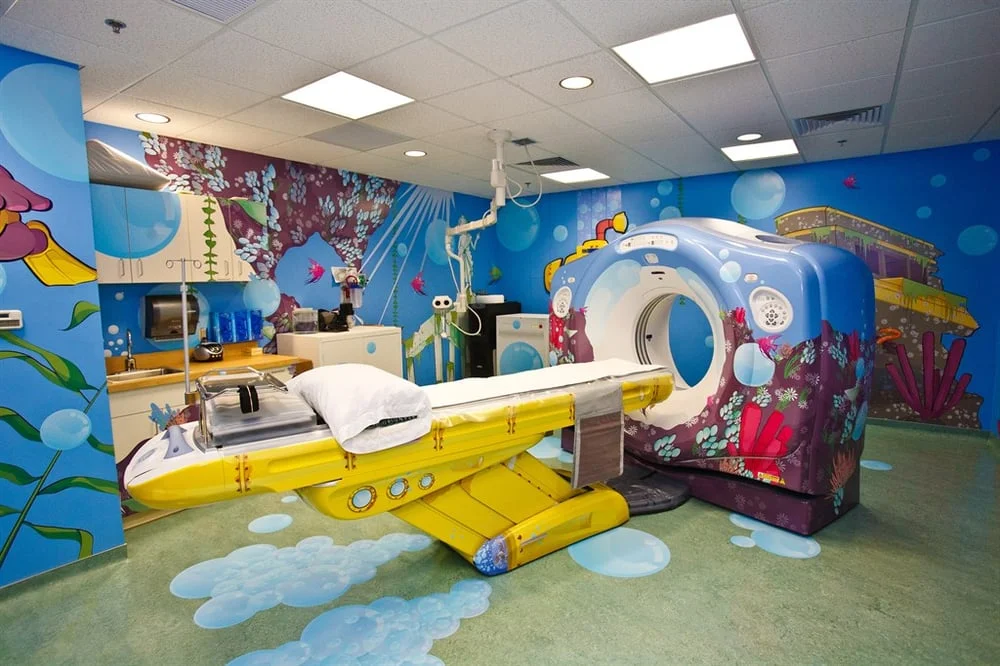

# Empatia

 

## Entendendo o usuário

Em Design Thinking, temos várias formas de fazer as abordagens de entrevistas para nos aproximarmos das usuárias e usuários. Variam bastante conforme a empresa, o contexto e o tipo de estratégia para recolher as informações.

Por exemplo, a **Samsung** lançaria uma linha de televisões mais acessível. Para entender melhor o público-alvo destes produtos, as equipes foram para campo e realizaram entrevistas diretamente com as pessoas e vendedores de lojas populares.

O objetivo dessa abordagem foi entender muito mais sobre a relação dos consumidores com a mercadoria que queriam oferecer, para assim saberem se condiz com as projeções feitas.

Outra estratégia interessante adotada pela **Natura** diz respeito ao lançamento de um *shampoo* para uma linha com menor impacto ambiental. Para entender as relações das pessoas com as embalagens desses artigos, a empresa reuniu uma equipe em que cada membro passaria um determinado tempo na casa de alguns clientes para observar e analisar como as relações com os produtos aconteciam; como tratavam, armazenavam, descartavam e etc.

A **Ambev** utilizou uma abordagem própria quando pretendiam aumentar as vendas de água tônica; foi montada uma equipe com a tarefa de ir em bares e locais de *happy hour* para entender qual a relação das consumidoras e consumidores com as bebidas oferecidas no local.

Essas três estratégias citadas possuem um ponto em comum; como falamos no Mapa de Empatia e nas diversas etapas que envolvem o Design Thinking, esta parte de investigação é relacionada a **empatia**, e é neste momento que entenderemos melhor o perfil e as demandas dos clientes.

Quando falamos de um **perfil empático**, é essencial **ouvirmos** com atenção ao que as pessoas têm a dizer, **acolhendo** as informações corretamente. Também é importante observar as **expressões** faciais e corporais para interpretar as **emoções**. Para sermos realmente empáticos, não podemos ter **pré-julgamentos**, **preconceitos** e nem nos basear em **estereótipos**, estando sempre abertos para entender as necessidades alheias.

Devemos tentar entender quais são as reais demandas que fazem falta de maneira significativa quando não atendidas, sem fazer suposições. Por fim, somos orientados a encontrar uma solução viável e equilibrada, logo não há sugestões e falas vazias; devemos sempre trazer **algo de valor** para as pessoas.

Entendendo melhor o que é empatia e como se deram as abordagens citadas, temos três formas de executar uma estratégia.

> A **Imersão** aplicada pela Samsung busca entender como as usuárias e usuários pensam, o que se aproxima da nossa pesquisa inicial na Internet para o trabalho com a Andarilho;

> A **Observação** adotada pela Natura tenta olhar e aprender sobre o dia-a-dia das relações dos clientes com os produtos, somente tomando notas ser interferência significativa;

> O **Engajamento** realizado pelo exemplo da Ambev consiste em entrar no contexto de consumo para entender como as relações se dão nesses momentos e o que as pessoas têm a dizer.

São três abordagens diferentes e interessantes para pensarmos e aplicarmos nesta etapa, afinal precisamos nos aprofundar mais nos perfis, contextos e demandas dos clientes para escolher e elaborar a melhor estratégia para nossa solução.

 

## [Exercício] Abordagens para empatia

O designer Doug Dietz teve o desafio de criar um momento menos assustador para as crianças que precisavam realizar um exame de ressonância magnética e, para entender melhor seu usuário, se aproximou e observou de perto as crianças em um hospital, conversou com colaboradores do hospital, voluntários e até experts de um museu infantil.

 

 

Existem 3 formas de realizarmos pesquisas focadas em empatia: Imersão, Observação e Engajamento.

Qual é a abordagem predominante do caso apresentado da GE Helthcare?

- [x] A) Imersão, pois o designer entrevistou muitas as pessoas, tentando entender melhor o contexto pelo que diziam.
  > A ideia da abordagem de Imersão é, essencialmente, pesquisar com base no que as pessoas dizem, mantendo um certo distanciamento da situação, mas tomando nota de tudo o que as pessoas do contexto possam dizer.

- [ ] B) Observação, pois o designer estava em uma posição mais passiva, apenas tomando nota do que via acontecer.
  > Apesar de também ter parte em Observação, o designer passa mais tempo dedicado a investigar a fundo e ativamente o que cada uma daquelas pessoas tinha a dizer.

- [ ] C) Engajamento, porque o designer passa muito tempo no hospital, junto aos usuários que pretendia trabalhar.
  > Engajamento pressupõe uma participação ativa no ambiente do usuário, mas também nas atividades que são realizadas como, por exemplo, realizar o exame de ressonância magnética.

 

## Jornada do usuário

Agora que nos aprofundamos mais no conceito de empatia e já conhecemos melhor nossas usuárias e usuários, poderemos partir para a análise de seus **contextos**.

Começaremos com um **fluxo** contendo as etapas de **interação** das pessoas até o produto oferecido pela Andarilho. Como um primeiro fluxo, pensaremos em alguém que encontra um pacote de viagens dessa empresa e decide comprá-lo.

O primeiro passo seria a **criação da conta** no portal para cadastrar dados pessoais e de pagamento. Em seguida, a pessoa **compra um pacote**, recebe um **e-mail de confirmação** e pode finalmente **viajar**.

Como estamos falando de contexto, precisaremos entender melhor o que acontece em cada momento. Além de traçarmos o fluxo, distribuiremos elementos a serem analisados ao longo deste, como os **pensamentos**, **emoções** e **ações** das pessoas, bem como **pontos positivos** e **negativos**.

Na primeira etapa de criação de conta, as usuárias e usuárias realizam o cadastro de informações pessoas e formas de pagamento como já sabemos.

Já no segundo passo, os clientes conferem os detalhes do pacote e confirmam a compra.

Na terceira etapa de confirmação por e-mail, a mensagem é aberta e os dados são conferidos novamente.

Por fim, as pessoas reúnem as informações da viagem, se planejam e podem efetivamente viajar pelo pacote da Andarilho.

Essas são as ações realizadas dentro deste fluxo específico, as quais serão analisadas de acordo com o contexto das usuárias e usuários.

Ainda, refletiremos sobre os **pensamentos** e eventuais **dúvidas** dos clientes ao realizarem as funções do fluxo. A primeira questão é relativa à confiabilidade do site no momento da criação de conta com dados pessoais e de pagamento, afinal as pessoas estão adicionando informações privadas e importantes e precisam confiar que estão seguras.

No momento da compra do pacote ou no e-mail de confirmação, é possível que haja dúvida em relação à necessidade de imprimir algum documento ou *voucher* que valide a ação.

Já no caso de irem viajar efetivamente, as pessoas devem querer saber sobre as formas de entrar em contato com a empresa para resolução de eventuais problemas durante a viagem. Essa questão é nosso principal foco neste trabalho.

Além dessas dúvidas e pensamentos, levantaremos os pontos positivos dentro deste mesmo fluxo. O primeiro é a possibilidade dos clientes acompanharem as informações e atualizações da viagem através da conta individual cadastrada no primeiro passo.

Em seguida, a compra de pacote é bastante simples, pois as etapas de pagamento são claras e não causam muitas dúvidas, o que é bastante positivo.

Em relação ao e-mail que confirma a aquisição do produto, é importante para as usuárias e usuários terem segurança pelo *feedback* da confirmação.

Por fim, a etapa de viajar é extremamente positiva por fornecer uma experiência única, além dos demais pontos benéficos dessa ação que já citamos anteriormente.

Como também precisaremos nos atentar aos pontos negativos para melhorá-los, veremos onde há falhas no fluxo.

A criação de conta possui um longo cadastro com um grande formulário, demandando um tempo considerável.

A parte de aquisição de pacote não apresenta um problema significativo, mas notamos reclamações de clientes afirmando que o e-mail de confirmação demora muito a chegar depois da compra efetivada, gerando vários questionamentos sobre a confiabilidade do site, do sistema de pagamento e consequentemente da própria empresa.

Finalmente, chegamos ao principal problema: há pouco suporte e comunicação da empresa com os clientes em eventuais problemas durante a viagem.

Com o levantamento de pontos positivos e negativos, pensamentos e ações, nos aprofundamos sobre os contextos e poderemos já ter alguns **insights** sobre como resolver as falhas.

Na primeira etapa do fluxo em questão, uma **possibilidade** seria ter uma parte para inserir os dados menos relevantes em um segundo momento como um "registro preguiçoso", ficando somente o cadastro das informações essenciais para gerarmos um formulário mais prático e enxuto que agilize o andamento.

Na parte de comprar o pacote, poderíamos sugerir aos clientes que acessem a conta criada para adicionar as informações secundárias após o pagamento efetivado, com uma chamada de interesse para traçar viagens mais compatíveis com o perfil, enviar novidades, promoções e etc.

Sobre a confirmação, seria interessante adicionarmos um aviso na própria conta dentro do site com alguma notificação instantânea após o pagamento, para que assim o cliente possa atestar a compra em mais de um meio de contato e não aguarde tanto por um e-mail somente.

Já na última parte sobre a viagem em si, poderíamos criar mais canais de apoio e aumentaríamos a equipe de atendimento aos consumidores.

Quando tratamos todos esses passos, conseguiremos um panorama mais geral e complexo sobre o contexto.

Organizando nossas análises em uma tabela, colocamos as etapas do fluxo em colunas e as cruzamos com as linhas contendo as ações, as dúvidas e pensamentos, os pontos positivos, negativos e as oportunidades de resolução, tornando a visualização dos problemas e soluções mais clara.

Esse levantamento e organização em tabela consistem na **Jornada do Usuário** em Design Thinking.

 

## [Nota] Empatia x Simpatia

Entendemos que *empatia* é um termo bastante comentado ultimamente, e, como vimos na aula, trata-se da primeira etapa do processo de Design Thinking que estamos seguindo.

Porém, não podemos confundir empatia com *simpatia*, que é uma outra qualidade de significado parecido, mas que, em essência, é bem diferente. Confira o vídeo [*O poder da empatia*](https://www.youtube.com/watch?v=VRXmsVF_QFY) para ver no detalhe como funciona essa diferença.

É importante termos em mente que o comportamento empático é o que norteará nossa dinâmica do começo ao fim. 

Ainda que às vezes alguém no time se afaste um pouco da ideia e acabe se esquecendo do usuário e do real problema que estamos tratando, é muito importante, como time, exercermos o papel de relembrar.

No Design Thinking não temos uma hierarquia de grupo, todos são responsáveis pelo processo e pela eficácia das dinâmicas.

 

## [Nota] Mapeando o contexto

Ao entender melhor o usuário, temos a primeira parcela de entendimento sobre o problema que estamos tentando resolver, mas, além do usuário, temos também outra variável a considerar, como o *contexto* do problema.

Para isso, aprofundamos ainda mais a pesquisa, quer dizer, uma vez que temos ideia do usuário, vamos a uma abordagem de pesquisa mais próxima. 

Temos três tipos de abordagem: 
Imersiva, em entrevista diretamente com o usuário.
Observação, analisando e aprendendo pelo que observamos do usuário.
Engajamento, inserindo-nos na realidade do usuário para entendê-lo.

No caso da Andarilho, a opção foi pela abordagem imersiva, com uma entrevista online.

Depois de mapear as informações coletadas sobre o usuário com o *Mapa de empatia*, a Andarilho precisava mapear também o roteiro que o usuário seguia junto à empresa para, então, entender o contexto em que o problema se dá. Mas como fazer isso? 

Para fazer esse mapeamento, traçamos a *Jornada do usuário*, quer dizer, levantamos alguns trajetos que o usuário percorre, por exemplo, para comprar um pacote, e conectamos com alguns pontos que podem ser relevantes para analisar o que o usuário faz em cada um desses momentos.

Esse modelo pode variar muito de acordo com cada projeto, mas a Andarilho fez o mapeamento considerando estes pontos:
Ações
Dúvidas e pensamentos
Pontos positivos
Pontos negativos
Oportunidades

Ao criar uma tabela que cruza estes pontos com o trajeto percorrido pelo usuário, conseguimos ter uma visão mais clara sobre o contexto, olhando especialmente para a relação do usuário com o contexto.

 

 